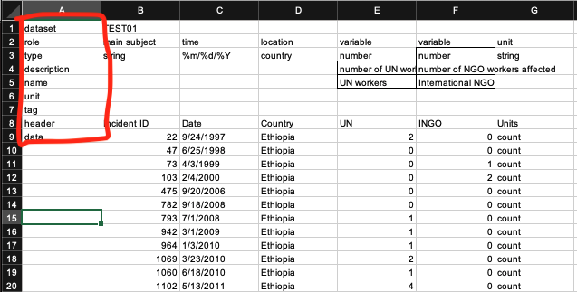
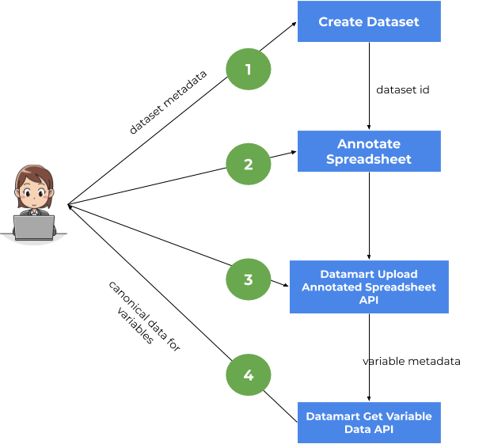
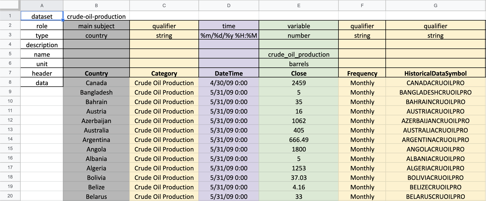
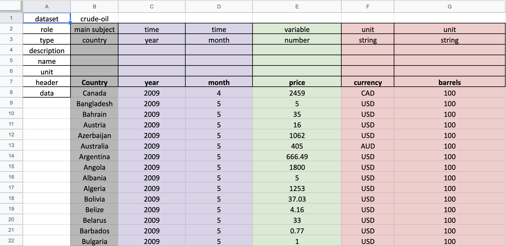
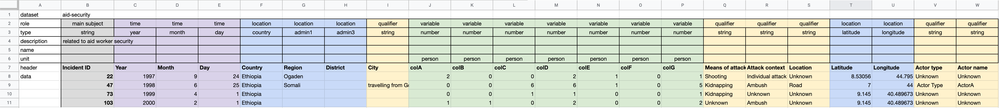
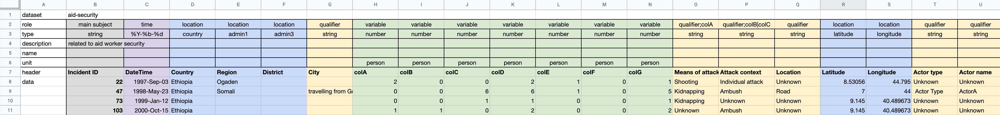

# Datamart Spreadsheet Annotation

Datamart Spreadsheet Annotation enables users to annotate spreadsheets with 
metadata to support conversion to KGTK format compatible with Datamart canonical data format.

## Annotations

A spreadsheet annotation consists of:

- A new column added as first column in the spreadsheet
- 6 new rows added at the top of the spreadsheet 

For example: Column A is inserted with top 6 rows being: `dataset`, `role`, `type`, `description`, `name`, and `unit`.
 

The first column must have the labels shown in cells A1:A6. If this is not the case, then annotation
validation will fail while uploading the annotated spreadsheet to Datamart.

### Annotation Description: cells A1:A6

#### dataset

This row should provide the [`dataset_id`](https://datamart-upload.readthedocs.io/en/latest/#dataset-definition) of the dataset this file belongs to.
The `dataset_id` should be created in the Datamart prior to uploading the annotated spreadsheet.

#### role
The `role` row specifies the role the columns has in the data. Any column may have a `role` annotation, but `role` annotations are not required for all
columns. Columns without `role` annotations will be ignored unless they have a `type` annotation (described below), in which case an error will
be shown to the user.

The permissible values for `role` annotation are:

- `main subject`:  indicates that the values in this column are the main subjects in each row. Users can think of `main subject`
as the entity, event, incident or location which is being described by other columns in the spreadsheet. At maximum one column can have this annotation.
-  `time`: indicates that the column contains time information that will be used in the canonical format. Multiple columns can have
a time annotations when times are split (year, month, day) across multiple columns as explained in the `type` section below. At least one time 
annotation must be present.
- `location`: indicates that a column contains location information. Multiple columns can have a `location` annotation as explained 
in the `type` section below. This annotation is optional, but if it not present, `main subject` is required. 
- `variable`: indicates that a column represents a dependent variable in the dataset. At least one variable annotation must be
present, it is common to have multiple variable annotations. Columns with variable annotations may contain numbers, 
strings or items. One can think of variables as the columns that one would plot on the Y-axis of a chart, with Time 
on the X-axis.
- `qualifier`: indicates that a column contains contextual information needed to interpret a variable. 
One can think of qualifiers as facets of a variable. When plotting a variable, it is common to encode qualifiers 
as colors or shapes, or to include them as check-boxes. For example, if a gender `qualifier` is present, 
then there could be male and female lines in the chart, each with a different color, or checkboxes could be 
present to select the gender to view. The qualifier annotation is optional.
- `unit`: indicates that a column contains information about the units of variables.

#### type
The type row specifies semantic types for the columns to enable precise parsing of the contents of columns. 
Columns with `role` annotations must also have a `type` annotation, and `type` annotations cannot be provided 
for columns without a `role` annotation.

Valid `type` for each `role` are as follows:

- `main subject`: {`string`, `entity`}
- `time`: {`year`, `month`, `day`, [Python regex format for a date, eg, %m/%d/%Y](https://docs.python.org/3.7/library/datetime.html#strftime-and-strptime-behavior) }
- `location`: {`admin1`, `admin2`, `admin3`, `longitude`, `latitude`, `country`}
- `variable`: {`number`}
- `qualifier`:{`string`}
- `unit`: {`string`}

#### name
The `name` row allows users to enter descriptive names for columns with `variable` or qualifier role annotations; 
names cannot be provided for columns with other roles. Names are optional, and when not provided, 
the header of the column is used as the name.

#### description
The `description` row allows users to provide a longer description for columns with `variable` or `qualifier` 
role annotations; similar to names, description annotations cannot be provided for columns with other roles, 
and descriptions are optional.

#### unit
The unit row allows users to specify units for columns with `variable` role annotations. 
When provided, the unit is a string that designates the units to be used for all values of the `variable`. 
Units are optional as some spreadsheets have units columns to designate units for each row.

### Additional Annotations

#### header
The `header` annotation marks the row that contains the headers of the spreadsheet; this annotation is 
useful for spreadsheets where the header is not the first row of the spreadsheet. This annotation is optional;
 when not present, row 7 is assumed to contain the headers.
 
#### data
The `data` annotation marks the first row of the spreadsheet that contains the data; this annotation is 
useful for spreadsheets where the data does not immediately follow the headers. This annotation is optional;

   - If both `header` and `data` annotations are not present, row 8 is assumed to be the start of the data.
   - If `header` annotation is present and `data` annotation is missing, { `header + 1` } is assumed as start of data.
   
## Annotations: Fine Details

1. By default, `location`, `time`, `qualifier` and `unit` annotations are applied to every variable. If there are
multiple variables, this means each variable receives the full set of `location`, `time`, `qualifier` and `unit` 
annotations.
2. If a column has no annotation, it will be skipped.
3. The following is true for `qualifier` and `unit` annotations:
    - These annotations can use `;` to indicate that the annotated column should be used with a specific `variable` column.
    For example; lets say we have a `variable` column with heading "fatalities" and a `qualifier` column with heading "location".
    `qualifier;fatalities` on the column "location" indicates that this qualifier column should be used only with 
    column "fatalities".
    - It is possible to attach the annotation to multiple variables by separating the column names with "|" as `qualifier;fatalities|injuries`, 
    or  `unit;price|currency`.
4. Special case for `unit` annotation.
    - When multiple `unit` annotations are present, they are concatenated together, separated by commas, from 
    left to right.
    
## User Workflow



### Step 1: Create Dataset

Users will have to create the `dataset` as specified in cell `B1` in the annotated spreadsheet, if it does not already exist.
The Upload Annotated Spreadsheet API will return a validation error in case the `dataset` either:

- does not exist or ,
- does not match the dataset in the API URL (see Step 3)

How to create a dataset is explained in the `Create a new dataset` section in this [jupyter noteboook](https://github.com/usc-isi-i2/datamart-api/blob/development/Datamart%20Data%20API%20Demo.ipynb)

### Step 2: Annotate Spreadsheet

Next step is to annotate the spreadsheet, as described in this document. The upload Annotated Spreadsheet
API will validate the annotation in terms of,

- presence of required roles
- corresponding types for each role
- at max one column annotated as `main subject`
- one of `main subject` or `location` should be present
- at least one column annotated as `variable`

### Step 3: Upload the Annotated Spreadsheet

Next step is to upload the annotated spreadsheet to Datamart using the `/datasets/{dataset_id}/annotated` API. An example is shown in `Upload an Annotated Spreadsheet section` in the [jupyter notebook](Upload an Annotated spreadsheet)

**Note: The Annotated Spreadsheet should be an Excel file with  `.xlsx` extension.**

### Step 4: Get Canonical data for the `variables` created

The Upload Annotated Spreadsheet API returns the metadata for all the variables created. Example:

```
 {
    "name": "Total affected",
    "variable_id": "total_affected",
    "description": "Total affected in TEST01",
    "corresponds_to_property": "PVARIABLE-QTEST01-019",
    "qualifier": [
      {
        "name": "stated in",
        "identifier": "P248"
      },
      {
        "name": "point in time",
        "identifier": "P585"
      }
    ]
  }
```

Users can use the `variable_id` to get the canonical data back. 
An example is shown in the `Get time series data for a variable` section in the [jupyter notebook](https://github.com/usc-isi-i2/datamart-api/blob/development/Datamart%20Data%20API%20Demo.ipynb)

## Examples

### [Crude Oil Production](https://docs.google.com/spreadsheets/d/1XSKOcTcdyI1u72QaQ_ICq1GWgGtyTjt3/edit#gid=517749731)


Annotation Details:

- `main subject` is `country`, which is Column B
- `time` is specified as a Python date format regex - `%m/%d/%y %H:%M`, column C
- column C is annotation as `variable`, which is the crude oil production. Note that the we specify
the `name` (crude_oil_production) as the origin column header `Close` is very generic. Also we specify the units as `barrels`.
- The spreadsheet has 3 columns annotated as `qualifier`

### [Crude Oil Price](https://docs.google.com/spreadsheets/d/1DELSd9DaMXvSNZxUG9r8rKtz0n4MMY34/edit#gid=517749731)


Annotation Details:

- `time` is split into 2 columns "C" and "D" which are annotated as `year` and `month` respectively.
- there are 2 columns annotated as units. This will be interpreted as `unit` being "currency, barrels". For example, "CAD, 100" for row 8.

### [AID Sample](https://docs.google.com/spreadsheets/d/1Lc_fV2Hls0BZMNvPzScpddTO7tQW1hCyh-BG5wfRsG8/edit#gid=0)


Annotation Details:

- `main subject` is column B, "Incident ID" which is of type "string".
- columns "J,K,L,M,N,O" are annotated as `variable`.
- columns "F,G,H,T,U" are annotated as `location`. These location qualifiers will be applied to all variables
- columns "Q,R,S,V,W" are annotated as `qualifier`. These qualifiers will be applied to all variables

### [AID Sample: Variable Specific Qualifiers](https://docs.google.com/spreadsheets/d/1xdranuaX7IB-n0SjcAQsv4mS-4b8W5XB_nZur8hDG4M/edit#gid=0)


Annotation Details:

- column "O" is annotated as `qualifier` (qualifier;colA) for column "H" with header "colA". This qualifier will only be applied to column "H"
- column "P" is annotated as `qualifier` (qualifier;colB|colC) for columns "I" and "J" with headers "colB" and "colC" respectively.
This qualifier will only be applied to columns "I" and "J".
- columns "Q,T,U" are also annotated as `qualifier`. These will be applied to all columns annotated as `variable`.
- `location` columns "D,E,F,R,S" will be applied to all columns annotated as `variable`.


 


  


